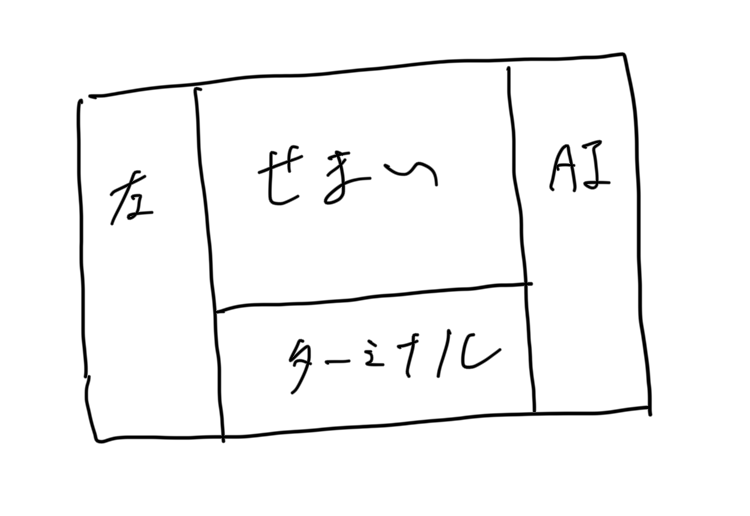
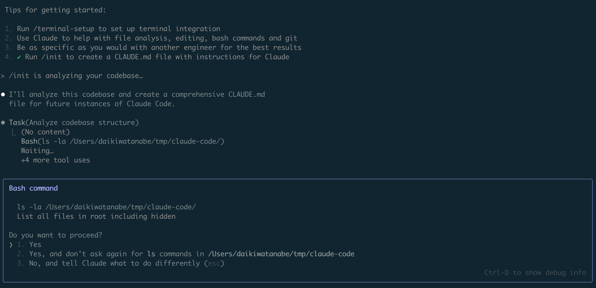
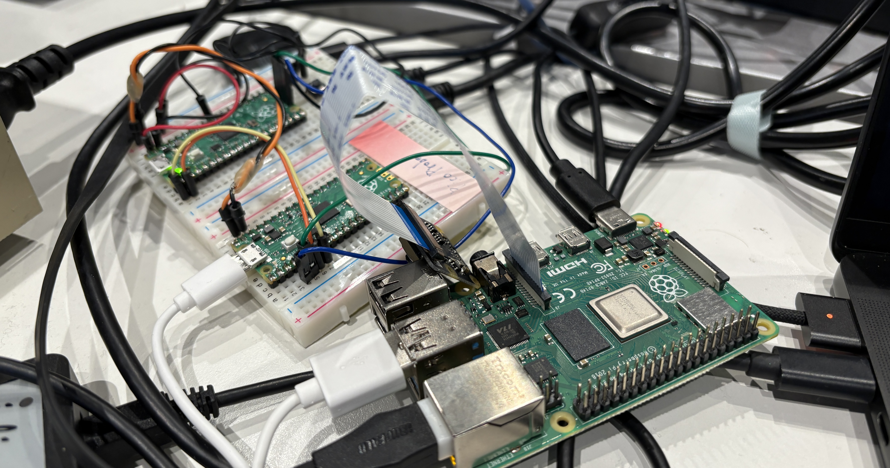
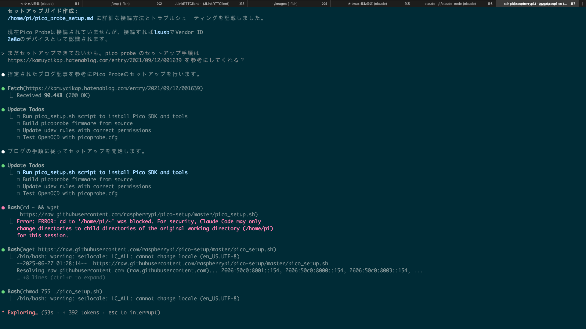
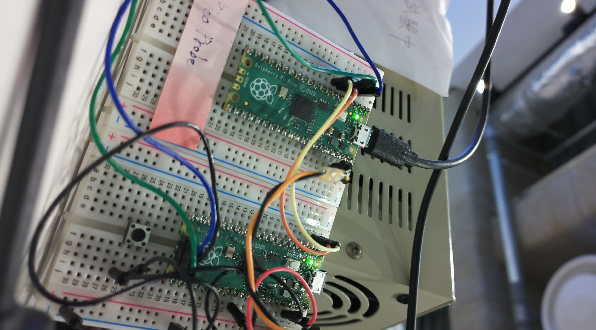

<style>
  .mermaid {
    width: 100%;
    height: 100%;
    background: none; // preタグの装飾消し
    border: none // preタグの装飾消し
  }
  .mermaid svg {
    display: block;
    min-width: 100%;
    max-width: 100%;
    max-height: 100%;
    margin: 0 auto
  }
</style>

# Claude Code 爽快手放し運転

# on Raspberry Pi

<!--
_paginate: false
_footer: © 2025 渡邊
-->

---

## 世は Coding Agent 群雄割拠時代

<div style="display: flex; justify-content: space-between">
  <div style="width: 45%">
    <h4>ローカル</h4>
    <ul>
      <li>Cursor Agent モード</li>
      <li>GitHub Copilot Agent</li>
      <li>Claude Code</li>
      <li>Gemini CLI</li>
      <li>Codex CLI</li>
      <li>Amazon Q</li>
    </ul>
  </div>

  <div style="width: 45%">
    <h4>リモート</h4>
    <ul>
      <li>Devin</li>
      <li>Google Jules</li>
      <li>Codex</li>
      <li>Manus</li>
      <li>OpenHands</li>
    </ul>
  </div>
</div>

---

## Claude Code

[Claude Code概要 - Anthropic](https://docs.anthropic.com/ja/docs/claude-code/overview) より

> ターミナル内で動作し、コードベースを理解し、自然言語コマンドを通じてより高速なコーディングを支援するエージェンティックなコーディングツールであるClaude Code

---

## Claude Code

- Claude Opus/Sonnet 4 を基盤モデルとして、
- ターミナル上で動作する、
- コーディングエージェント

特に、

---

<span style="font-size: 5em">ターミナルで動作すること</span>

が嬉しい

---

## ターミナルで動くとなぜ良いのか

<div style="display: flex; gap: 2rem;">
  <div style="flex: 1;">
    <ul>
      <li>ターミナルから出なくて済む</li>
      <li>IDE がせまくならなくて済む</li>
      <li>他のツールとパイプ経由で組み合わせやすい</li>
    </ul>
  </div>
  <div style="flex: 1;">
    
  </div>
</div>

---

## Claude Code は許可を求める



---

## `~/.claude/settings.json` による権限移譲

[Claude Code settings - Anthropic](https://docs.anthropic.com/en/docs/claude-code/settings) を参考に

```json
{
  "permissions": {
    "allow": [
      "Bash(npm run lint)",
      "Bash(npm run test:*)",
      "Read(~/.zshrc)"
    ],
    "deny": [
      "Bash(curl:*)"
    ]
  }
}
```

---

## 手放し運転の誘惑

- いちいち許可するのがあまりに面倒、僕は面倒見の良い管理者ではない
- 許可なく全て実行するのは、実質 RCE を受け入れているようなもの。セキュリティレベル📉

<br>
<br>

... では隔離しよう！

---

## サンドボックス環境の要素

<div style="display: flex; align-items: flex-start; gap: 2rem;">
  <div style="flex: 1;">
    <ul>
      <li>Raspberry Pi</li>
      <li>Tailscale (VPN)</li>
      <li>Claude Code</li>
      <li>tmux</li>
    </ul>
  </div>
  <div style="flex: 1;">
    
  </div>
</div>

<div style="display: none;">
graph TB
  subgraph VPN[Tailscale VPN]
    PC -->|SSH| RP

    subgraph RP[Raspberry Pi]
      subgraph TM[tmux]
        CC[Claude Code]
      end
    end
  end
  style RP fill:#f9f,stroke:#333,stroke-width:2px
  style TM fill:#ddf,stroke:#333,stroke-width:2px
  style CC fill:#5dd,stroke:#333,stroke-width:2px
</div>

---



---

## 準備

```bash
# common
sudo apt install vim tmux

# claude-code
sudo apt update
sudo apt install nodejs npm
sudo npm install -g @anthropic-ai/claude-code

apt install curl
curl -fsSL https://deb.nodesource.com/setup_18.x | bash - 
apt show nodejs
apt install nodejs

claude # 認証用 URL が表示されるので、ブラウザで開いて認証コードをコピー

# tailscale
curl -fsSL https://tailscale.com/install.sh | sh
echo 'net.ipv4.ip_forward = 1' | sudo tee -a /etc/sysctl.d/99-tailscale.conf
echo 'net.ipv6.conf.all.forwarding = 1' | sudo tee -a /etc/sysctl.d/99-tailscale.conf
sudo sysctl -p /etc/sysctl.d/99-tailscale.conf
sudo tailscale up
```

---

## ログイン時に claude を起動

`~/.bashrc` に以下を追加

```~/.bashrc
# tmux with claude
if [[ -n $SSH_CONNECTION ]] && [[ -z $TMUX ]] && [[ $- == *i* ]]; then
    tmux new-session -A -s main 'claude --continue --dangerously-skip-permissions'
fi
```

---

## ついでにラズパイを組込開発者にする

```
- Raspberry Pi Pico を接続して、片方をデバッグプローブとして扱ってください
- カメラを接続しておくので、ターゲットの様子を確認するのに使ってください
```

---



---

<video src="./files/movie.mov" width="100%">

---

撮れた写真



---


## まとめ

- 手放し運転する時は、サンドボックス環境を用意するとよい、ラズパイや適当なコンテナなど
- Claude Code 楽しいのでみんなやろう、 Plus プランから利用できる

---

# おわり

---

## 参考

- Claude Code
  - [Claude Code どこまでも/ Claude Code Everywhere   - Speaker Deck](https://speakerdeck.com/nwiizo/claude-everywhere)
  - [Claude Code: Best Practices and Pro Tips](https://htdocs.dev/posts/claude-code-best-practices-and-pro-tips/)
  - [Get started with Claude - Anthropic](https://docs.anthropic.com/en/docs/get-started)
- その他
  - [Raspberry Pi で Tailscale VPN を動かすまでの覚書](https://zenn.dev/xin9le/articles/98c82f4998e22f)

---

## Appendix: XDG 対応

https://github.com/anthropics/claude-code/issues/1455

- XDG 準拠に変更しようとしている: `~/.claude` -> `~/.config/claude`
- キャッシュ更新されない

流転激しい AI ツールの細かい仕様に振り回されるのは非本質的、激おこ
