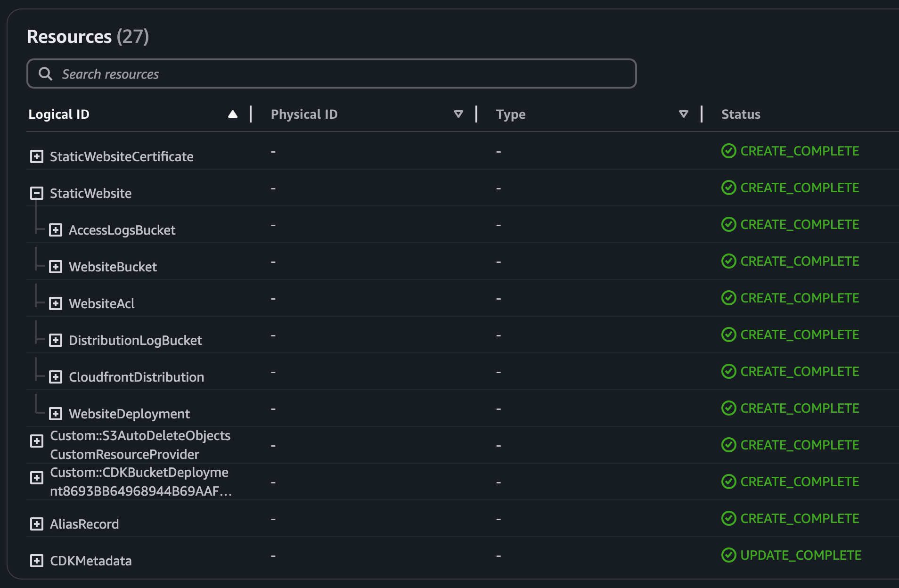

# CDK で簡単に静的サイトホスティングをする

<!--
_paginate: false
_header: ""
-->

at: [クラスメソッドのAWS CDK事情大公開スペシャル#2 - connpass](https://classmethod.connpass.com/event/337711/)
src: [daikw/slides](https://github.com/daikw/slides)

---

## 自己紹介

<div style="display: flex; align-items: center;">
  <div style="flex: 1; padding: 10px;">
  
  </div>
  <div style="flex: 1; padding: 10px;">
    <a href="https://github.com/daikw">
      daikw (Daiki Watanabe)
      
    </a>

- 🏐 バレーボール歴: 15年
- 🦾 組込開発歴: 2年
- 🌐 クラウドインフラ歴: 2年
- 🧑‍💻 CDK 歴: 半年

  </div>
</div>

---

## 株式会社 Photosynth

<div style="display: flex; align-items: center;">
  <div style="flex: 1; padding: 10px;">
    
  </div>
  <div style="flex: 1; padding: 10px;">

- 🔐 主に [Akerun](https://akerun.com/) を作っています
- 📝 [テックブログ](https://akerun.hateblo.jp/) あります！
- 🧑‍💻 メカ・エレキの設計 / 組込 / モバイル / クラウド / Web 開発と、 IoT 大体全部やっています。レイヤ横断したいエンジニアは楽しめると思います

  </div>
</div>

---

## CDK の用途

- 社内限定ツールのホスティングに利用
- ツールが少しずつ増えてきたのでサービスディレクトリを作りたい

-> CDK で完結する、静的サイトホスティングの手段が必要

---

## AWS における静的サイトホスティング

| 構成                   | 特徴         | HTTPS |
| ---------------------- | ------------ | :---: |
| Amazon S3              | 簡単         |   x   |
| AWS Amplify            | IAM がカオス |   o   |
| Amazon CloudFront + S3 | 設定が面倒   |   o   |

<br/>

**面倒な設定の頻出パターン** -> **コンストラクト化が向いていそう**

---

## Construct Hub から絞り込み

- AWS CDK v2
- キーワード: spa, website, static

<span style="font-size: 25px;">

| パッケージ名                                                                                                                       | バージョン<br>(最新) | ダウンロード<br>[weekly] | cdk-nag | 複雑さ <br> (私見) |
| ---------------------------------------------------------------------------------------------------------------------------------- | -------------------- | :----------------------: | :-----: | :----------------: |
| [cdk-spa-deploy](https://constructs.dev/packages/cdk-spa-deploy/v/2.0.0-alpha.1?lang=typescript)                                   | 2.0.0-alpha.1        |           636            |    🆖    |         低         |
| [@cloudcomponents/cdk-static-website](https://constructs.dev/packages/@cloudcomponents/cdk-static-website/v/2.2.0?lang=typescript) | 2.2.0                |           230            |    🆖    |         中         |
| [@aws/pdk/static-website](https://constructs.dev/packages/@aws/pdk/static-website/v/0.19.68?lang=typescript)                       | 0.19.68              |           114            |    ✅    |         高         |

</span>

---

## 共通点

- S3 + CloudFront + Route 53
- `BucketDeployment` を利用しローカルのファイルをデプロイ

---

## 相違点

<span style="font-size: 23px;">

| パッケージ名                        | WebACL                | CDK API                                        |
| ----------------------------------- | --------------------- | ---------------------------------------------- |
| cdk-spa-deploy                      | :x: 設定なし          | 古いものを利用 (CloudFrontWebDistributionなど) |
| @cloudcomponents/cdk-static-website | 既存の WebACL を利用  | 古いものを利用 (CloudFrontWebDistributionなど) |
| @aws/pdk/static-website             | :o: WebACL を自動生成 | 最新を利用 (Distributionなど)                  |

参考:

- [AWS WAFをCloudFrontに導入する | DevelopersIO](https://dev.classmethod.jp/articles/aws-waf-cloudfront/)
- [CloudFront DistributionのCDK Constructの新しいクラスを使って静的サイトホスティング（Amazon S3）の配信を構築してみた | DevelopersIO](https://dev.classmethod.jp/articles/build-a-static-site-hosting-delivery-with-amaozn-s3-using-cloudfront-distributions-new-cdk-constrain/)

</span>

---

## cdk-spa-deploy

<span style="font-size: 25px;">

- シンプルな単一ファイルからなるコンストラクト
- ダウンロード数が多い
- カスタムドメインで利用するとき: 証明書・DNSレコードまでまとめて生成される
- :warning: 利用されている API が古い ([CloudFrontWebDistribution](https://docs.aws.amazon.com/cdk/api/v2/docs/aws-cdk-lib.aws_cloudfront.CloudFrontWebDistribution.html), [DnsValidatedCertificate](https://docs.aws.amazon.com/cdk/api/v2/docs/aws-cdk-lib.aws_certificatemanager.DnsValidatedCertificate.html))

```ts
new SPADeploy(this, 'SPADeploy')
  .createSiteWithCloudfront({
    indexDoc: 'index.html',
    websiteFolder: 'path/to/your/static/webpage',
    cfAliases: [yourDomainName]
  });
```

</span>

---

## @cloudcomponents/cdk-static-website

<span style="font-size: 25px;">

- GitHub Organization が一人でメンテされている: [hupe1980 (Frank Hübner)](https://github.com/hupe1980)
- カスタムドメインで利用するとき: DNSレコードは生成される、証明書は生成されない
- :warning: 利用されている API が古い ([CloudFrontWebDistribution](https://docs.aws.amazon.com/cdk/api/v2/docs/aws-cdk-lib.aws_cloudfront.CloudFrontWebDistribution.html)), 証明書周りが、なんか、動かなそう ...？

```ts
new StaticWebsite(this, 'StaticWebsite', {
  bucketConfiguration: {
    source: 'path/to/your/static/webpage',
  },
  aliasConfiguration: {
    domainName: 'domain.com',
    names: ['www.domain.com', 'domain.com'],
    acmCertRef: certificateArn,
  },
});
```

</span>

---

## @aws/pdk/static-website

<span style="font-size: 25px;">

- [AWS Project Development Kit (PDK)](https://aws.github.io/aws-pdk/) で定義のあるコンストラクト
- PDK 特有の実装が多く、やや複雑
- カスタムリソースによる WebACL の動的生成を利用し IP 制限をサポート
- pdk-nag に対応しているらしい
- :rotating_light: カスタムドメインで利用するとき: 証明書・DNSレコードは生成されない

</span>

<span style="font-size: 20px;">

```ts
const staticWebsite = new StaticWebsite(this, 'StaticWebsite', {
  websiteContentPath: 'path/to/your/static/webpage',
  distributionProps: {
    domainNames: [yourDomainName],
    certificate,
  },
});
new ARecord(this, 'AliasRecord', {
  zone: hostedZone,
  recordName: yourDomainName,
  target: RecordTarget.fromAlias(new targets.CloudFrontTarget(staticWebsite.cloudFrontDistribution)),
});
```

</span>

---

## pdk-nag って？

- `cdk-nag` のラッパー、`cdk-nag` より少し設定がマイルドそう（ `AwsSolutionsChecks` のプロジェクトで `pdk/static-website` を利用しようとしたら違反が少し出た）
- [`AwsPrototyping`](https://github.com/aws/aws-pdk/tree/22771cbe4d3ec3186104dcea14da0eeeaaa5fb79/packages/pdk-nag/src/packs) という独自の cdk-nag ルールを定めて、これに準拠している
  - プロジェクトで cdk-nag をすでに利用している場合は要検討

---

## @aws/pdk/static-website を使ってみる

ハマりポイントはほとんどなかった、2点だけ

- CloudFront の証明書を利用する場合、 `us-east-1` を要求される
  - 証明書を同じスタック内で作成する場合、スタック丸ごと `us-east-1` にする必要がある
- 全部よしなにやってくれるつもりでいると、カスタムドメインの設定がうまくいかない
  - `distributionProps` でドメイン設定したつもりが、 A レコードはないのでアクセスできない

---

## @aws/pdk/static-website を使ってみる

作成されるリソース



---

## まとめ

- :+1: ごく単純な静的サイトホスティングは GitHub Pages / Netlify / Vercel などの方が圧倒的に楽、楽をしよう
- :ok: AWS で静的サイトホスティングが必要な場合は、CDK を使って楽をしよう
- :wheel: よく使われているコンストラクトも以外と古い。新しめのものを参考に、自分で作るのが良いかも

---

## おわり

<!--
_paginate: false
_header: ""
-->
